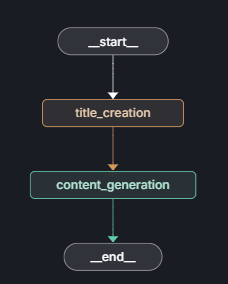
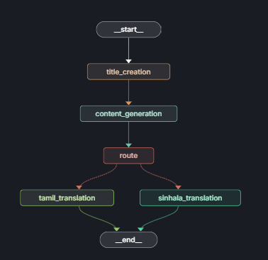

# 🤖 Agentic AI Blog Generator

This is an Agentic AI-powered blog generation system built using the **uv** framework and **FastAPI**. It supports multilingual blog generation in **English**, **Tamil**, and **Sinhala**, based on simple JSON input.

## ✨ Features

* 🌐 Generates blog content in **English**, **Tamil**, or **Sinhala**.
* ⚡ FastAPI backend to handle blog requests.
* 🔧 Built using **LangGraph** and **LangChain**.
* 📝 Supports two separate Agentic Graphs:

  * One for English blogs.
  * One for Tamil and Sinhala blogs.
* 📦 Easily configurable via `.env` file.
* 📃 Cleanly managed with `requirements.txt` and `uv` for dependency management.

---

## 🔧 How to Use

### ✅ Step 1: Clone the Repository

```bash
git clone https://github.com/yourusername/agentic-blog-generator.git
cd agentic-blog-generator
```

### 🔍 Step 2: Install Dependencies

Ensure you have `uv` installed, then run:

```bash
uv add -r requirements.txt
```

### 🔐 Step 3: Set Up Environment Variables

Create a `.env` file and include the following:

```dotenv
GROQ_API_KEY=your_groq_api_key
LANGCHAIN_API_KEY=your_langchain_api_key
```

### ⚖️ Step 4: Launch LangGraph Studio

To open the graph in **LangGraph Studio**, run:

```bash
langgraph dev
```

There are **2 graphs** available:

* English Blog Graph
* Tamil & Sinhala Blog Graph

Modify the `./src/graphs/graph_builder.py` file to select which graph to open.

---

## 🚀 Run the App

After setting up your environment, start the FastAPI server with:

```bash
python app.py
```

---

## ✍️ API Usage

Send a `POST` request to `/blogs` endpoint with one of the following formats:

### ✉️ English Blog Generation

```json
{
  "topic": "The Future of Artificial Intelligence"
}
```

### 🇹🇭/🇵🇬 Tamil or Sinhala Blog Generation

```json
{
  "topic": "குறின் மைத்துத்து உருந்த முன்னை",
  "language": "tamil"
}
```

```json
{
  "topic": "වෙරිඩ කටාරන්සර්බින වරාවරය",
  "language": "sinhala"
}
```

---

## 🖼️ Graph Visuals

*Include graph images below*

### English Blog Graph



### Tamil & Sinhala Blog Graph



---

## 🚜 Project Structure

```
.
├── app.py                         # Main FastAPI app
├── requirements.txt              # Dependencies
├── .env                          # API keys (GROQ and LangChain)
├── src
│   └── graphs
│       └── graph_builder.py      # Modify to open selected LangGraph
└── assets
    ├── english_graph.png
    └── tamil_sinhala_graph.png
```

---

## 📅 Built With

* [FastAPI](https://fastapi.tiangolo.com/)
* [LangGraph](https://www.langchain.com/langgraph)
* [LangChain](https://www.langchain.com/)
* [uv](https://github.com/astral-sh/uv)

---

## 🌟 Credits

Created with ❤️ by \Nivakaran — built for multi-lingual blog automation.

---

## ✊ Contribute

Feel free to fork, star, and contribute!

---

## ⚠️ License

This project is licensed under the MIT License.

---
